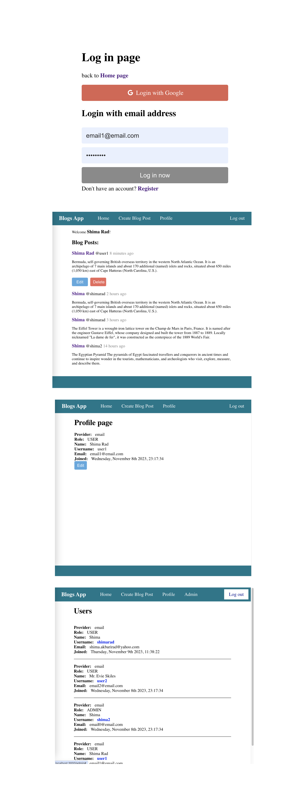

# MERN Blog App

A simple MERN (MongoDB, Express.js, React, Node.js) blog application that allows users to write and view blog posts. The app includes features such as user authentication, login/logout functionality, and admin capabilities to view and manage users.



## Features

- **User Authentication:** Users can register, log in, and log out securely.
- **Write and Publish Blog Posts:** Authenticated users can write and publish their blog posts.
- **View Published Blog Posts:** Users can view a list of published blog posts.
- **Admin Dashboard:** Admin users have access to a dashboard where they can view and manage user accounts.

## Technologies Used

- **MongoDB:** Database to store blog post data and user information.
- **Express.js:** Backend framework to handle server-side logic.
- **React:** Frontend library for building user interfaces.
- **Node.js:** JavaScript runtime for server-side development.

## Getting Started


### Installation

1. Clone the repository:

   ```bash
   git clone https://github.com/radshima/Blog-App/

2. Install dependencies for both the server and client:  

    ```bash
    cd server && npm install
    cd ../client && npm install

3. Create & seed the Database: 

    ```bash
    docker-compose up mdp-mongo

4. Run the server:

   ```bash
   $ npm run server

5. Run the client:

   ```bash
   $ npm start

App will load on https://localhost:3000.  


## license
This project is licensed under the MIT License.

## Next Steps
ability for users to like and comment on posts